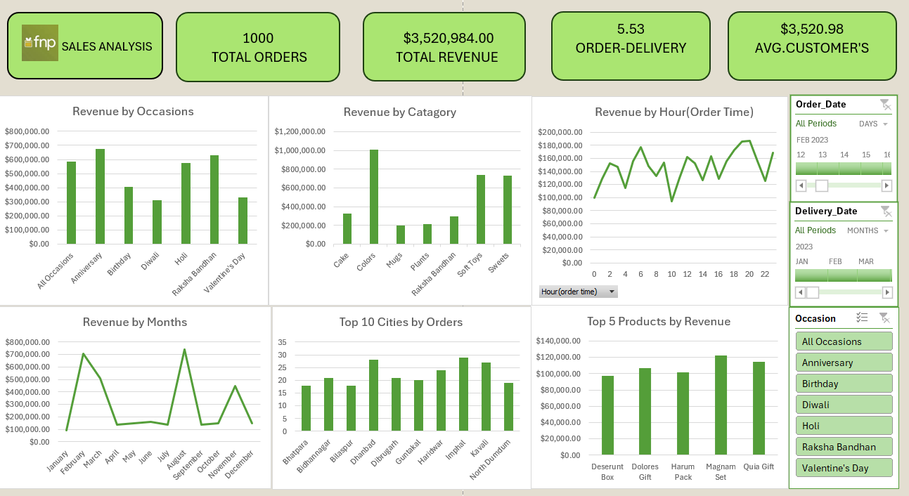

# 📊 Sales Analysis Dashboard

Interactive Excel Sales Dashboard built using Data Modeling and DAX to analyze sales performance, revenue trends, customer behavior, and order delivery insights.

---

## 🔹 Dashboard Preview

---

## 🔹 Project Overview
This project analyzes sales data using Excel Data Modeling techniques.  
The dashboard provides insights into:

- Total Orders
- Total Revenue
- Average Customer Spend
- Order Delivery Time
- Revenue by Category
- Revenue by Occasion
- Revenue by Hour

---

## 🔹 Tools & Technologies Used
- Microsoft Excel
- Data Modeling
- DAX (Data Analysis Expressions)
- Pivot Tables & Charts

---

## 🔹 Key Insights
- Identified peak revenue categories
- Analyzed customer purchase trends
- Measured average delivery time
- Evaluated revenue performance by time and occasion

---

## 🔹 Dataset Files
- customers.csv
- orders.csv
- products.csv
